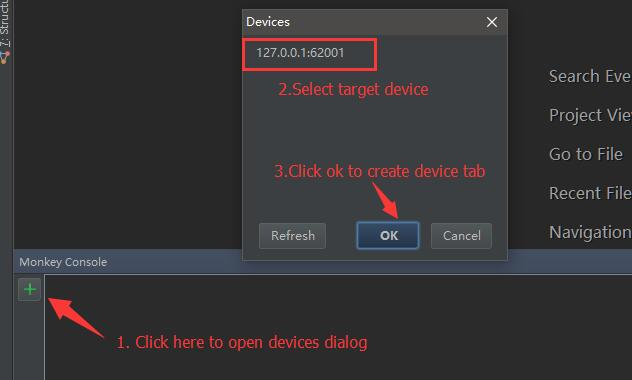
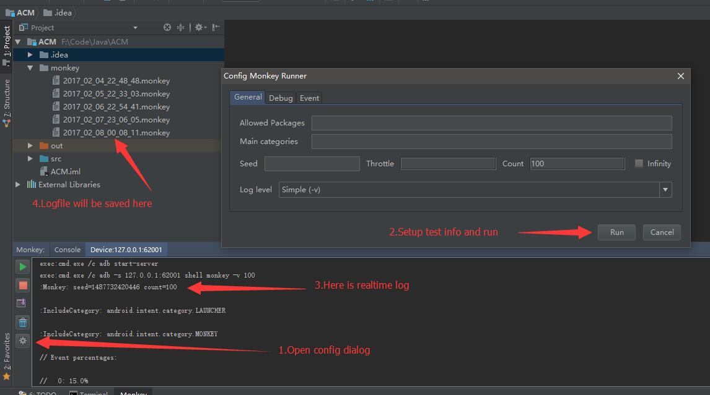

# MonkeyMaster
An Intellij Idea plugin help android developer to deal with monkey test command. Pre-release now available for you, though it may be not that stable, but it works, ^_^~.

# Setup
You will find MonkeyMaster in JetBrains repositories **when stable version is done**, before that, you have to install it manually:

  - Download [latest released jar](https://github.com/DrkCore/MonkeyMaster/releases/download/v1.0-alpha2/MonkeyMaster_v1.0-alpha2.jar)
  - File -> Settings -> Plugins -> Install plugin from disk -> Select jar file
  - Restart Intellij Idea/Android Studio to enable plugin

If nothing worng, MonkeyMaster tool panel will be present in the bottom sidebar, like this:

# How to use

